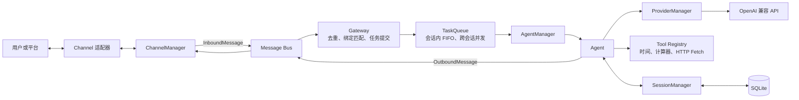

# LuckyClaw

LuckyClaw 是一个用 Go 编写的轻量 AI Agent 运行时。它通过统一消息模型连接渠道、Agent 与大模型服务，支持多 Provider、多 Agent 路由、按会话排队和 SQLite 会话持久化。

当前仓库实现了网页工作台、终端渠道以及 OpenAI Chat Completions 兼容的 Provider，可作为接入其他平台渠道和模型服务的最小运行骨架。

## 核心能力

- 使用 `provider/model` 引用在多个 Provider 和模型之间显式选择。
- 支持完整 Tool Calling Agent Loop，内置时间、计算器和受 SSRF 防护的 HTTP Fetch。
- 按线程、聊天、渠道账号和默认 Agent 的优先级路由消息。
- 同一会话严格按 FIFO 顺序处理，不同会话受全局并发上限控制。
- 对平台消息 ID 去重，并限制单个会话的等待队列长度。
- 将活动会话、模型选择和上下文持久化到 SQLite。
- 提供 `/new` 与 `/model` 命令管理终端会话。
- 提供嵌入式网页工作台，集中查看 Agent、管理会话、聊天和编辑 Soul。

## 架构



入站消息先被转换为统一的 `InboundMessage`。Gateway 完成去重并提交到按会话隔离的任务队列，随后选择 Agent、模型和 Provider。Agent 仅在模型调用成功后写入会话上下文，最终通过 `OutboundMessage` 返回原渠道。

## 本地启动

要求：Go 1.26，以及至少一个 OpenAI Chat Completions 兼容服务的 API Key。

1. 复制示例配置：

   ```bash
   cp config.example.yaml config.yaml
   ```

2. 设置配置引用的环境变量。示例配置读取 `DEEPSEEK_API_KEY`：

   ```bash
   export DEEPSEEK_API_KEY="你的 API Key"
   ```

3. 从仓库根目录启动：

   ```bash
   go run ./cmd/luckyclaw
   ```

4. 打开网页工作台：

   ```text
   http://127.0.0.1:8080
   ```

网页端会展示 `config.yaml` 中配置的全部 Agent。点击 Agent 卡片后可以创建和恢复独立会话、切换该会话使用的模型，并在设置中编辑 Soul；保存后的 Soul 会从下一条消息开始生效。MCP 与飞书、Telegram 等平台连接页目前保留了界面和状态设计，等待对应后端适配器接入。

也可以先构建二进制：

```bash
go build -o luckyclaw ./cmd/luckyclaw
./luckyclaw
```

按 `Ctrl+C` 或 `Ctrl+D` 可以安全退出。默认会话数据库位于 `data/luckyclaw.db`。

### 网页监听配置

网页工作台默认只监听本机。如需修改端口，可以在配置中加入：

```yaml
web:
  listen: 127.0.0.1:8080
```

网页接口目前没有登录鉴权，不建议直接监听公网地址。

### API Key 配置

配置文件只保存环境变量名，不保存密钥本身：

```yaml
providers:
  deepseek:
    api_key_env: DEEPSEEK_API_KEY
    api_base: https://api.deepseek.com/v1
    api_type: openai-chat
    auth_type: bearer-token
    models:
      - deepseek-chat
```

每个 Provider 可以引用不同的环境变量。变量名缺失、变量未设置或值为空时，LuckyClaw 会在启动阶段直接报错。

### 工具循环配置

每个 Agent 可以独立限制工具调用轮数和单个工具的执行时间。省略或填写 `0` 时，默认最多执行 20 轮、每个工具最多执行 30 秒：

```yaml
agents:
  lucky:
    name: LuckyClaw
    soul_path: SOUL.md
    default_model: deepseek/deepseek-chat
    models:
      - deepseek/deepseek-chat
    max_tool_iterations: 20
    tool_timeout_seconds: 30
```

模型同一轮返回多个工具调用时，LuckyClaw 按返回顺序执行并保存结果。相同参数的调用第三次出现、连续三轮工具全部失败或达到迭代上限时，会禁用工具并要求模型根据已有结果生成最终文本。

内置工具如下：

| 工具 | 参数 | 安全边界 |
| --- | --- | --- |
| `current_time` | 可选 `timezone` | 只读取当前时间，时区必须是有效 IANA 名称 |
| `calculator` | `expression` | 只解析数字、括号和 `+ - * /`，不会执行代码 |
| `http_fetch` | `url`、可选 `max_chars` | 只访问公网 HTTP/HTTPS，拒绝私网与本机地址，并限制重定向和响应大小 |

## Docker 启动

构建镜像：

```bash
docker build -t luckyclaw .
```

使用示例配置和命名数据卷启动：

```bash
docker run --rm -it \
  -e DEEPSEEK_API_KEY \
  -v luckyclaw-data:/app/data \
  luckyclaw
```

镜像内置的 `config.example.yaml` 会作为默认 `config.yaml`。需要自定义 Provider、Agent 或绑定时，将本地配置挂载到固定路径：

```bash
docker run --rm -it \
  -e DEEPSEEK_API_KEY \
  -v "$PWD/config.yaml:/app/config.yaml:ro" \
  -v luckyclaw-data:/app/data \
  luckyclaw
```

## 终端命令

| 命令 | 作用 |
| --- | --- |
| `/new` | 创建并激活一段新会话 |
| `/model` 或 `/model list` | 查看当前模型、默认模型和模型白名单 |
| `/model <provider/model>` | 切换当前会话后续消息使用的模型 |
| `/model default` | 清除会话覆盖并恢复 Agent 默认模型 |

## 设计决策

- **统一消息边界**：渠道只负责平台消息与统一消息之间的转换，业务调度不依赖具体平台。
- **分层路由**：显式 `AgentID` 优先，其次依次匹配线程、聊天、渠道账号，最后使用默认 Agent。
- **会话并发模型**：完整会话地址是排队键；同一会话串行执行以保护上下文顺序，不同会话共享全局并发槽。
- **去重与背压**：Gateway 在排队前按平台消息 ID 去重；单会话队列达到上限时拒绝新任务并释放去重标记，允许平台稍后重试。
- **模型白名单**：Provider 声明模型目录，Agent 再声明自己的允许列表，防止消息选择未配置或未授权的模型。
- **SQLite 持久化**：数据库启用 WAL、外键、`busy_timeout` 和 `synchronous=NORMAL`；单写连接减少锁竞争，创建并激活会话使用同一事务。
- **完整工具消息链**：assistant tool call 与对应 tool result 按轮原子保存，下一次模型调用和进程重启都能恢复有效上下文。
- **工具循环保护**：单工具超时、重复调用检测、连续失败降级和最大迭代后的强制归纳共同限制失控循环。
- **先持久化后更新内存**：会话消息和模型选择只有在 SQLite 更新成功后才写入内存，避免进程状态领先于持久化状态。
- **密钥外置**：YAML 只声明 `api_key_env`；加载配置时读取环境变量并快速失败，避免将密钥提交到仓库。

## 测试

本地执行与 CI 一致的检查：

```bash
go test ./...
go test -race ./...
go vet ./...
go test -covermode=atomic -coverprofile=coverage.out ./...
go tool cover -func=coverage.out
```

### 终端烟测数据

以下步骤使用示例配置中的两个 DeepSeek 模型；模型自然语言输出不要求逐字一致。

| 顺序 | 输入或操作 | 预期行为 |
| --- | --- | --- |
| 1 | `/model` | 显示当前模型、默认模型和两个允许模型 |
| 2 | `/model deepseek/deepseek-reasoner` | 返回模型切换成功，随后 `/model` 显示 reasoner 为当前模型 |
| 3 | `请只用一句话解释 Go 的 goroutine。` | 返回非空模型回答，不出现通用处理失败提示 |
| 4 | `它与操作系统线程有什么区别？` | 回答能够承接上一轮的 goroutine 上下文 |
| 5 | 退出并重新启动，再输入 `/model` | 当前会话仍使用 reasoner，证明活动会话和模型选择已恢复 |
| 6 | `/new` | 返回形如 `s-时间戳-随机值` 的新会话 Key |
| 7 | 再次输入 `/model` | 新会话恢复使用 Agent 默认模型 |

自动化测试使用临时目录、注入式 HTTP Transport 和 scripted mock Provider，不需要真实 API Key 或访问外部模型服务。
